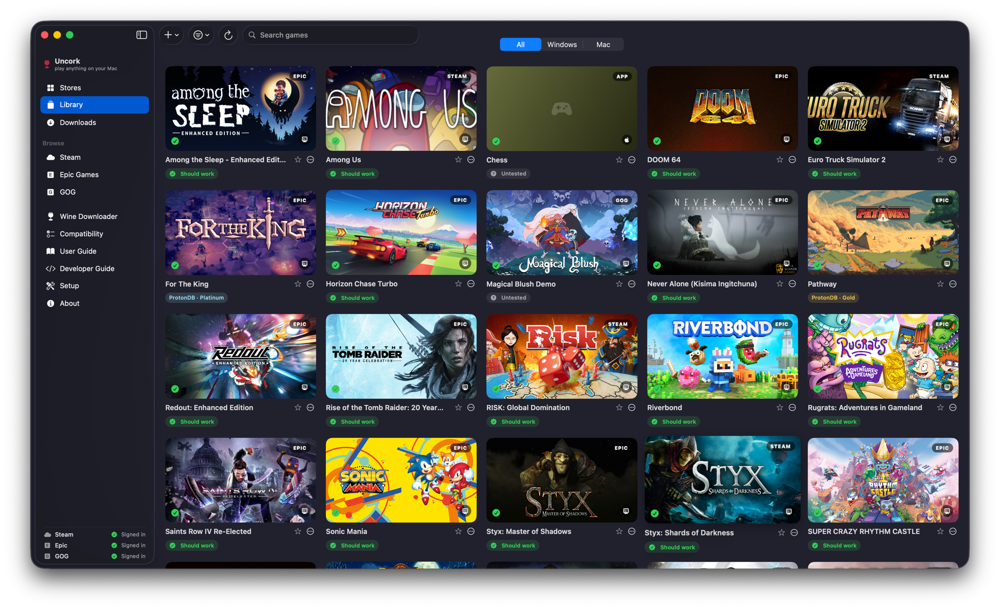
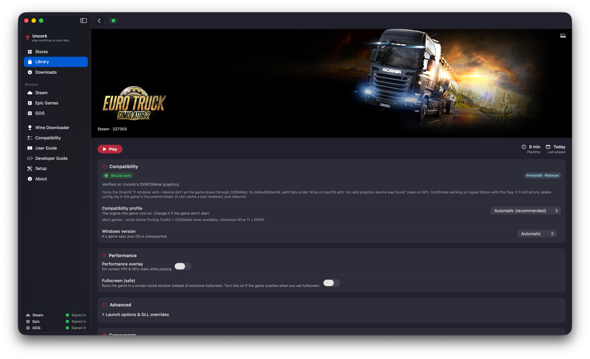
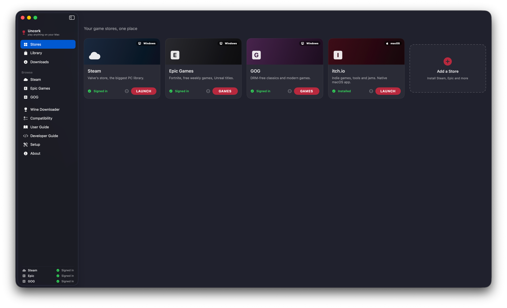
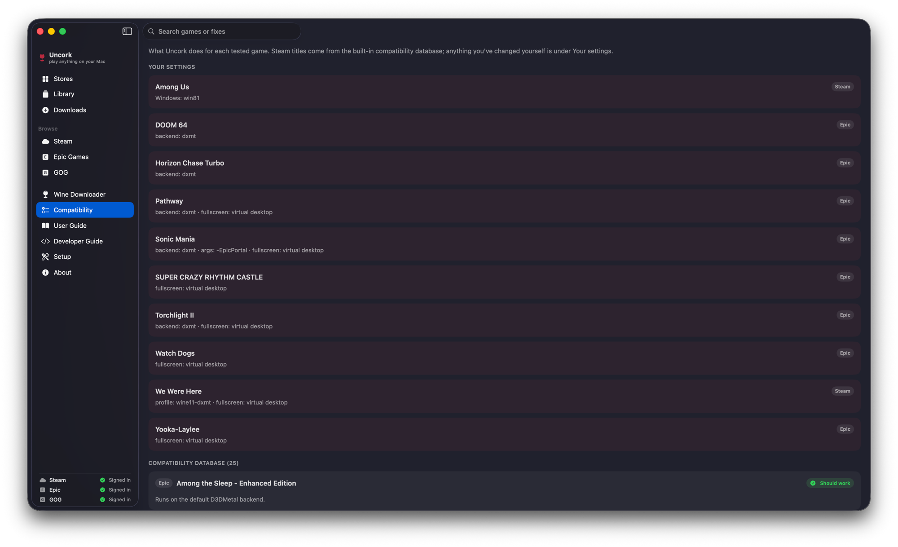
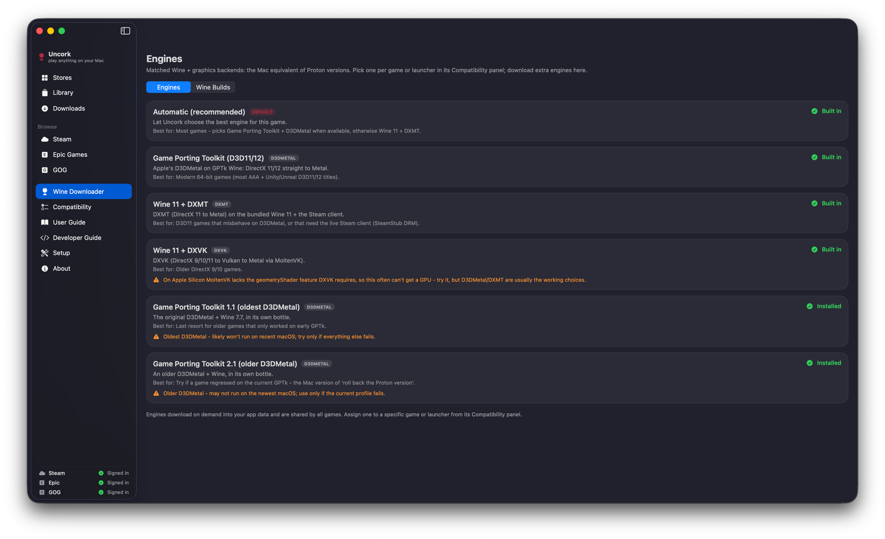
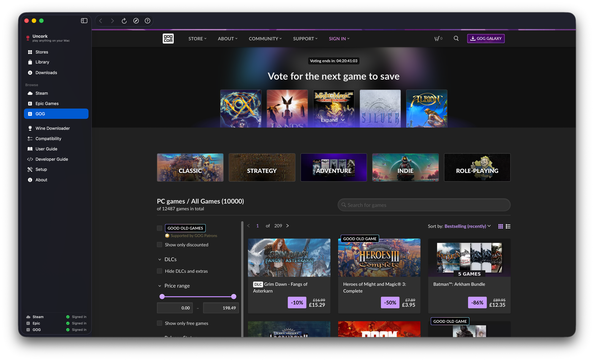
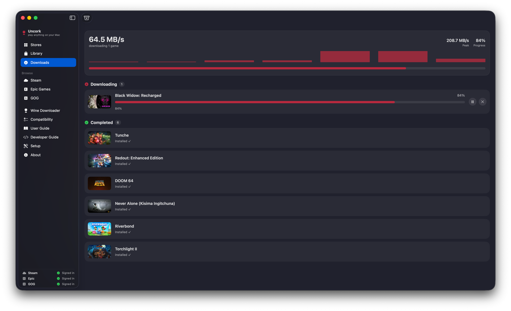

# Uncork

**Play Windows games on your Apple Silicon Mac, without the tinkering.**

Uncork is a native SwiftUI app that installs and runs Windows game stores and
games for you. Every storefront gets one friendly home: connect, install, and
press Play. No manual Wine, no command line, no admin rights.




Open source, Apple Silicon only, for now.

## Features

**Your stores, one place**
- Set up **Steam, Epic, and GOG** and sign in with your own accounts; owned games
  appear in a single Library.
- Native Mac launchers (**Battle.net**, **itch.io**) install as their real macOS
  apps, with no Wine at all.
- **Browse the store** inside the app: buy or claim on Steam, Epic, or GOG without
  leaving Uncork, then install from your Library.
- Add your own storefront with the **Add a Store** wizard.

**One Library for everything**
- Every owned game across stores, plus games you add yourself (a Windows `.exe` or
  a native macOS `.app`).
- **Mac / Windows / All** tabs, search, and filters.
- Installed games read at a glance; games you own but have not downloaded are
  dimmed with a clear badge.
- **Favorites**, **hidden games**, and **custom collections** to organize a big
  library.
- Custom cover and banner **artwork** for anything Uncork cannot fetch.

**Made to actually run games**
- A Steam-style page per game with a prominent Play button and every setting in
  one place.
- Per-game **graphics backend** (D3DMetal or DXMT) and **launch options**, for
  every store, not just Steam.
- **Cloud saves** for Epic and GOG; Steam saves ride Steam Cloud.
- **Verify & repair** re-checks and re-downloads a game's files.
- **Fullscreen (safe)** runs a game in a screen-sized window to dodge the exclusive
  fullscreen mode-switch that crashes many games under Wine.
- Choose where games **install** (Epic and GOG), handy on smaller drives.
- **Controller support** is on automatically in every game (see below).

**Know before you play**
- A plain-language **compatibility verdict** on every game (works / needs work /
  unsupported / untested), backed by a data-driven database.
- A browsable **Compatibility** page: what Uncork does for each tested game, plus
  your own per-game changes.
- Clear **anti-cheat** warnings for titles that cannot run on Apple Silicon
  (EAC / BattlEye have no macOS runtime).
- A per-game **launch log** and a **diagnostic relaunch** for when something won't
  start.

## Screenshots

Every game gets a Steam-style page: a big Play button, a plain-language
compatibility verdict, and all the per-game settings in one place.



| Your stores, one place | What works, and why |
| --- | --- |
|  |  |
| **Matched engines (the Mac take on Proton versions)** | **Browse and buy, without leaving the app** |
|  |  |

A built-in download manager with live speed and progress:



## Controllers

Uncork turns on gamepad support automatically in every game (games see the
controller through SDL). What matters is whether macOS itself recognizes your
controller, because Uncork can only pass on one that macOS already sees.

- **These work:** a genuine Xbox Series/One controller, a PlayStation DualSense or
  DualShock 4, any MFi controller, and 8BitDo pads in Xinput mode.
- **Nintendo Switch-style pads:** connect them over **Bluetooth**, not USB. macOS
  recognizes a Switch Pro-style pad over Bluetooth but not over its wired protocol.
- **These do not work:** third-party Xbox controllers that only Windows supports
  (for example the Turtle Beach Recon). macOS has no driver for them, so no app can
  use them; a hardware adapter (MayFlash Magic-NS, 8BitDo wireless adapter) can
  convert one to a controller macOS accepts.
- **Not detected?** Launch the game first, then unplug and replug (or re-pair) the
  controller.

## Status

Early access. Expect rough edges: some games are flaky or do not run at all. Each
title shows an expected-compatibility badge, and the in-app **Compatibility** page
lists what is known to work.

Confirmed working on Apple Silicon include Euro Truck Simulator 2, Rise of the Tomb
Raider, RISK: Global Domination, Sonic Mania, Horizon Chase Turbo, DOOM 64,
Torchlight II, Among the Sleep, and Styx, among others. Titles with kernel-level
anti-cheat (competitive online shooters and racers) cannot run and are flagged as
such.

## Requirements

- Apple Silicon Mac (M1 or newer).
- macOS 14 (Sonoma) or later.
- Xcode command-line tools: `xcode-select --install`
- Rosetta 2: `softwareupdate --install-rosetta --agree-to-license`
  (the engine runs x86-64 Wine under Rosetta).
- An internet connection for first-run setup and installing your games.

## Installing and building

You can build Uncork two ways.

### From source (a clone)

A clone contains source only. The Wine engines and graphics backend are large
binaries that are not committed; they download on first use. The quickest path is a
slim build, which omits the engines and fetches them the first time they are needed:

```bash
git clone https://github.com/PapaRascal2020/uncork.git
cd uncork
UNCORK_SLIM=1 bash scripts/package-app.sh    # produces build/Uncork.app
```

### From the build kit

For a fully self-contained build with the engines already included (useful offline,
or on a machine without the downloads), use the build kit that
`scripts/make-build-kit.sh` produces:

```bash
tar -xzf uncork-build-kit.tar.gz
cd uncork-build-kit
bash scripts/package-app.sh                  # produces build/Uncork.app
```

Building on the target Mac is also what keeps code-signing clean: the app is signed
on the machine that creates it, so there is no transfer quarantine from shipping a
pre-built `.app`. Either way, `swift build` inside `app/` is a quick compile check.

## How it works

Uncork is a SwiftUI app driving shell scripts that drive Wine, with a
DirectX-to-Metal translation layer on top. The app is the interface; the engine
work (prefixes, store installs, launching, per-game fixes) lives in `scripts/` and
is data-driven, so most fixes ship as data rather than a new build. Where a store or
game has a real Mac version, Uncork uses it; where it does not, it runs the Windows
version through Wine.

```
app/          SwiftUI application
scripts/      the engine: bottle setup, store install, launch, fixes
compat/       data-driven databases (game fixes, profiles, store templates)
wine-fixes/   patched-Wine engine recipes, patches, and the Wine build catalog
docs/         developer and user guides
```

## Documentation

- `docs/user-guide.html`: the in-app user guide.
- `docs/DEVELOPERS.md` and `docs/developer-guide.html`: how the app is built and how
  to contribute a fix or a new store.

## Contributing

Uncork is free and open source, and built to be extended. Most fixes are data, not
code: a game's settings live in `compat/gamefixes.json` and a new store is a template
in `compat/store-templates.json`, so you can fix a game or add a store without
rebuilding the app. Game fixes, store templates, Wine build recipes, and patches are
all welcome. See `docs/DEVELOPERS.md` to get started.

## License

Uncork is licensed under **GPL-3.0** (see `LICENSE`). It bundles and orchestrates
third-party components (Wine, DXVK, DXMT, MoltenVK, and the Epic/GOG command-line
clients), each under its own license, and downloads Apple's Game Porting Toolkit at
runtime rather than redistributing it. The full component list, licenses, and
upstream sources are in `THIRD-PARTY-NOTICES.md`.
